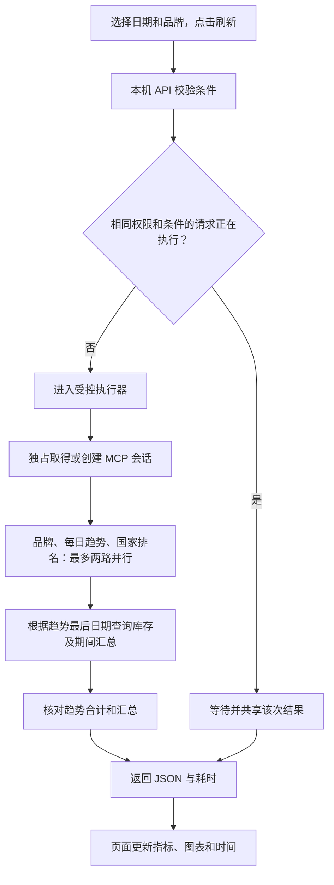

# 从数据连接到看板展示：实现说明与交接

版本：2026-09-10，含内网实时分享；范围：Codex 中运行的独立看板，尚未迁入 DSH。

## 1. 技术栈一览

| 层次 | 当前实现 | 职责 |
|---|---|---|
| 页面 | HTML、CSS、原生 JavaScript、SVG | 日期和品牌筛选、指标、趋势、排名、明细、定时刷新 |
| 图表设计 | Lieflat Charts / Mono，F2 Hairline Line、F5 Tick Rows | 提供视觉模板参考；运行时无需图表 CDN |
| 本机 API | Python 3.11+ 标准库 ThreadingHTTPServer | 提供页面、校验参数、组织查询、返回 JSON |
| 通用执行 | ThreadPoolExecutor、Future、LifoQueue、线程锁 | 两路受控并行、独占会话池、相同在途请求合并 |
| 数据连接 | http.client.HTTPSConnection、JSON-RPC、MCP | HTTPS 认证、初始化、会话复用、工具调用 |
| 数据服务 | data-gateway → SCM_SR_PRO → StarRocks 表 | 执行受权限约束的只读 SQL |
| 观测与测试 | logging / RotatingFileHandler、unittest | 耗时记录、日志轮转、自动检查 |

实际运行使用 Python 3.13；无额外 Python 包，无 Node 构建要求。没有 React、ECharts、Redis 或本地业务数据库。Codex 是开发和预览环境；查询实际由本机 Python 服务调用 MCP 网关完成，不依赖模型逐次生成查询。

## 2. 数据连接从哪里开始

`gateway.py` 从运行用户的 `~/.codex/config.toml` 读取 `mcp_servers.data-gateway`。配置包含 URL 和 Authorization 请求头；浏览器从不获得访问令牌。包内提供仅含占位符的配置示例，应合并到现有配置，不能覆盖整个 Codex 配置文件。

初始化流程：读取配置 → 建立 HTTPS 连接 → 发送 initialize → 接收协商后的协议版本与可能的 Mcp-Session-Id → 发送 notifications/initialized → 调用 tools/call。

搭建阶段曾用 list_tables / describe_table 核实可见表及字段；每次刷新不会重新发现全部表。运行时调用 query_data，传入 sql 和 datasource_name。目前表固定为 `sql_chat.sql_chat_siso_d_en`，数据源固定为 `SCM_SR_PRO`。

客户端可解析 JSON 响应和网关当前使用的 SSE data 消息。它是适配当前网关的精简实现，不是覆盖所有传输、认证方式和事件格式的完整 MCP SDK。

## 3. 一次查询如何运行



首次无日期请求先查询最新日期，默认回溯 30 天；自定义日期请求直接进入期间查询。品牌、趋势、排名被提交给执行器，最多同时两项；汇总依赖趋势的最后业务日期。总共是首次默认 5 次业务 SQL、自定义日期 4 次，另有新建会话时的初始化开销。

日期范围包含起止两天，允许单日，最多 366 天。SQL 由后端固定结构生成；日期严格校验，品牌做长度限制、引号转义及可用选项核对。浏览器没有任意 SQL 执行入口。

## 4. 四项性能能力的实际边界

### 会话和连接复用
每个池槽独占客户端，避免同一个 MCP 序号、响应流被多个线程同时操作。JSON 响应可复用 HTTPS 连接；SSE 收到目标响应后关闭该传输连接，但保留 MCP 会话供后续请求使用。配置指纹变化时不复用不匹配的池槽。失败的客户端会被丢弃，下次请求重新创建。

**尚未实现同次请求中的失效连接自动重试**；此前只是提出了优化建议。

### 受控并行
当前每个 QueryRuntime 最多 2 项查询执行，最多 8 组不同条件的在途看板请求，超出返回 429。运行中查询不能强制取消；退出时尝试取消尚未执行的关联任务并等待已运行任务完成。

### 相同请求合并
合并键包括凭据配置指纹、数据源、表、日期或默认窗口、品牌。两个请求只有在执行时间重叠且键相同时才共享 Future。结束后立即移除，不缓存已经完成的查询结果。指纹只在内存中使用，不记录原始凭据。不同条件仍独立访问数据源。

### 耗时记录
成功响应包含 requestId、durationMs、responseMs、sharedRequest，以及 timings 中各阶段的 queueMs、sessionMs、queryMs、sessionReused。页面悬停查询耗时文字可查看阶段信息。

performance.log 单文件约 2 MB，保留 3 份轮转备份。成功请求记录阶段耗时，部分拒绝及失败记录总耗时和通用状态；尚无统一慢查询报表、P95 聚合、全路径追踪或报警。不会记录 SQL、令牌、筛选值和业务结果。

## 5. 数据口径和正确性

- SI：所选期间发货求和；SO：融合激活求和（限两年发货口径），不代表零售订单。
- 库存：所选期间最后一个有数据的业务日快照，不跨日相加。
- 国家覆盖：country_code 去重，含零值记录；排名只展示 SI 前十。
- NULL 不补零，缺失日期不补零，负值保留，趋势缺日断开；原始 id 不作为唯一键擅自去重。
- 解析层核对返回行数、列数及错误标志，达到 5000 行限制时拒绝可能被截断的结果。
- 每日 SI、SO、记录数合计与汇总再次核对；不一致不替换页面。
- 多条 SQL 并非数据库同一事务快照，上游更新期间仍可能不一致，不能把求和检查视为完整快照保证。

## 6. 页面与服务接口

| 接口 | 用途 |
|---|---|
| GET / | 加载单 HTML 看板 |
| GET /healthz | 检查本机服务存活，不代表数据源正常 |
| GET /api/dashboard?start=2026-09-01&end=2026-09-03&brand=TECNO | 自定义期间查询 |
| GET /api/dashboard | 默认最近 30 个日历日，以最新业务日期为终点 |

分享更新后服务监听 0.0.0.0:4319，仅接受本机或当前内网 IP 的 Host。回环地址页面具有管理权限；内网访客必须持有效分享令牌。详情见 SHARE-GUIDE.md。返回 no-store，页面内存保留上次成功结果及时间戳。选择新条件后点击刷新，自动刷新在条件待提交或页面隐藏时暂停。可选每分钟、每五分钟、仅手动。它是轮询查询，不是数据库实时推送；业务数据日期与查询时间分别展示。

## 7. 代码目录与启动

| 文件 | 主要入口 |
|---|---|
| gateway.py | Gateway.__init__ / call / close：连接和 MCP |
| query_runtime.py | QueryRuntime.submit、SingleFlight.run、credential_scope、record |
| server.py | Handler.do_GET、dashboard、query、parse_result、validate_dates |
| index.html | refresh、render、drawTrend、drawRanking、tick |
| test_dashboard.py | 日期、结果解析、接口失败与来源保护检查 |
| test_runtime.py | 并发上限、复用、失败丢弃、合并、隔离及清理检查 |
| sharing.py / test_sharing.py | 有效期、撤销、分享范围与访问控制及测试 |
| SHARE-GUIDE.md | 分享人操作、网络条件和分享接口说明 |
| DELIVERY-NOTES.md | 本次交付范围与迁移注意事项 |
| config.example.toml | 无凭据配置示例 |
| README.md / LIEFLAT-LICENSE.txt | 使用说明与图表模板许可 |

解压到本地，准备 Python 3.11+，将示例配置字段合并到用户目录 `.codex/config.toml`，填入自己的地址和令牌，确保能访问数据源网络。在解压目录执行：

```powershell
python server.py
```

然后打开 http://127.0.0.1:4319/ 。服务须持续运行。退出该前台进程会停止服务；当前部署采用隐藏后台进程，不含开机自启或进程守护。若端口被占用，先确认已有同一服务，避免重复启动。令牌权限也必须覆盖代码指定的数据源和表。

运行测试（不会执行真实业务查询）：

```powershell
python -m unittest discover -p 'test_*.py' -v
```

已验证 10 项自动检查，以及真实源的默认日期、自定义日期、单日品牌筛选、三请求合并、内网分享和撤销。一个三日期全品牌样本为改造前 1153 ms、改造后首次 545 ms、复用后 217 ms；这是本机单次样本，非通用 SLA。

## 8. 通用化时复用什么、还要补什么

可复用：会话池、受控执行器、在途合并机制、耗时结构、页面加载与失败状态模式。

需为每个数据源适配：连接工厂、返回格式解析、表和指标定义、筛选校验、权限上下文、依赖查询计划。当前 credential_scope 仍读取单一 data-gateway 配置，server.py 仍固定当前表和字段；尚未建成任意数据源的配置式接入平台。

多用户部署还需服务端认证及可靠权限隔离、按数据源/用户限流、部署级服务生命周期管理。当前 HTTPServer 和单进程内存合并适用于本机及小范围内网演示，不提供跨进程请求合并。数据库索引、预汇总、结果缓存、任务取消、自动重试、慢查询统计均未在本版实现。

图表模板附带 PolyForm Noncommercial 1.0.0 许可，商业使用需处理对应模板授权。打包并不改变原有许可范围。
